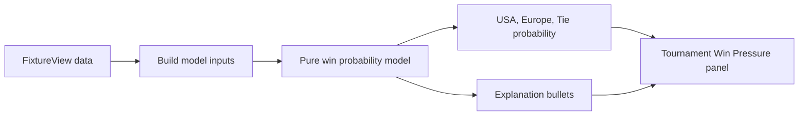

# Win Probability MVP

## Product Stance

Build this as **Win Pressure**, not a definitive oracle. It should deepen the live board while preserving Ruff Ryder volatility: show a forecast, show why it moved, and keep language like `forecast, not fate` or `chaos still live` when there are many holes left.

The MVP should avoid a semi-intensive data model. No Supabase migration, no stored predictions, no AI dependency, and no background jobs. Recompute in-memory from the same live fixture data already used by `[src/features/tournament2026/components/LeaderboardSection.tsx](src/features/tournament2026/components/LeaderboardSection.tsx)`.

## Recommended Model

Use a small pure model based on existing match state:

- Current tournament score from saved hole outcomes, matching `[src/features/tournament2026/viewUtils.ts](src/features/tournament2026/viewUtils.ts)` `calculateTotals()`.
- Remaining available holes from segment `hole_start`, `hole_end`, and missing/unplayed score rows, matching `[src/domain/2026/matchPlayStatus.ts](src/domain/2026/matchPlayStatus.ts)`.
- Segment status from `calculateSegmentMatchPlayStatus()` so mathematically closed segments stop contributing volatility.
- Per-hole probabilities from an explainable Bayesian prior:
  - Start neutral, with halved holes allowed.
  - Blend in observed segment/tournament hole outcomes as scores are saved.
  - Add a small singles-only CPI nudge when both players have CPI, bounded so early forecasts do not overreact.
  - Keep foursomes mostly neutral unless live outcomes provide signal.
- Calculate USA win / Europe win / tie probability with dynamic programming over remaining holes, not Monte Carlo. This is deterministic, fast, and testable.

## Implementation Shape

- Add `[src/domain/2026/winProbability.ts](src/domain/2026/winProbability.ts)` for pure calculation over small domain inputs, independent of Supabase service types.
- Add a thin adapter in `[src/features/tournament2026/winProbability.ts](src/features/tournament2026/winProbability.ts)` to convert `FixtureView[]` and `PlayerRow[]` into model inputs.
- Add a compact `WinPressureSection` in `[src/features/tournament2026/components/LeaderboardSection.tsx](src/features/tournament2026/components/LeaderboardSection.tsx)`, near `Score Ledger` / `Live Score Curve`.
- Use existing team colors and terminal layout from `[DESIGN.md](DESIGN.md)`: a compact probability bar, three tabular percentages, and 2-3 explanation lines such as `Europe lead +4 with 9 holes left`.
- Keep empty/early states honest: before any saved holes, show neutral/no-signal copy rather than fake precision.

## Guardrails

- Do not call it `AI` and do not generate it through OpenAI.
- Do not persist model output unless a later real need appears, for example historical replay of probability movement.
- Cap non-final probabilities below certainty unless the score is mathematically locked.
- Include tie probability, because tournament-level halved outcomes are possible.
- Track one analytics event only if useful, e.g. section expanded/viewed, not every recalculation.

## Tests

Add focused Vitest coverage:

- Early close scenarios stay around neutral despite a small lead.
- Late close scenarios swing strongly toward the leader.
- Mathematically locked tournaments return 100% for the locked side.
- Halves/ties are represented, not hidden.
- CPI affects singles only and stays bounded.
- Foursomes do not use CPI.
- Adapter handles missing players, empty fixtures, unplayed holes, and completed segments.

## Docs

If implemented, update `[AGENTS.md](AGENTS.md)` with one short note that Win Pressure is a derived, non-persisted forecast in the 2026 Tournament tab and that pure probability logic belongs in `src/domain/2026/`. Update `[DESIGN.md](DESIGN.md)` only if the visual pattern becomes a reusable scoreboard convention.